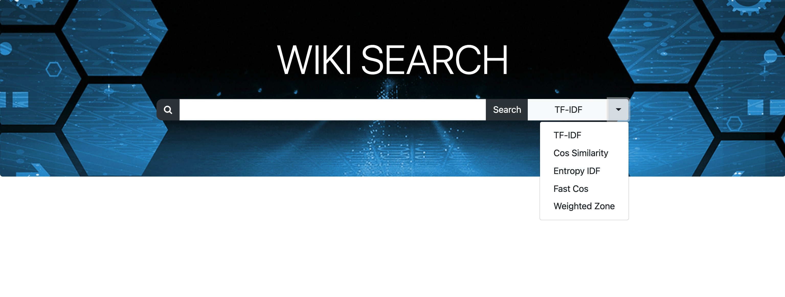
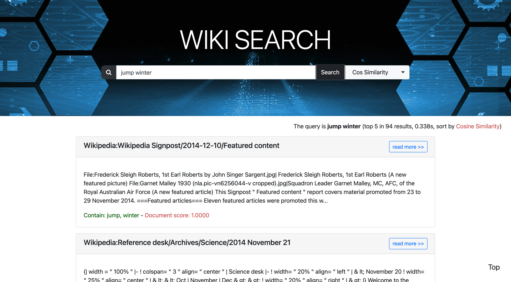
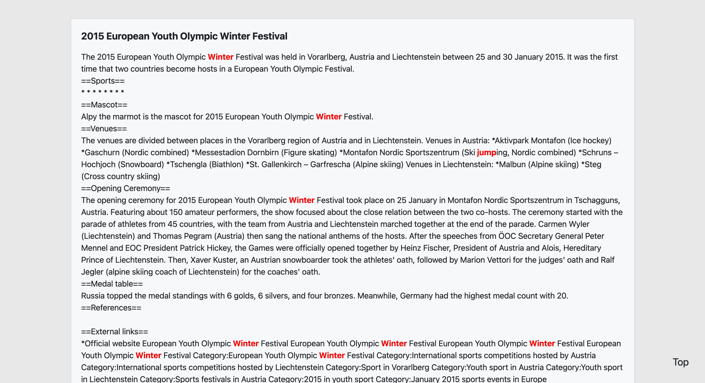
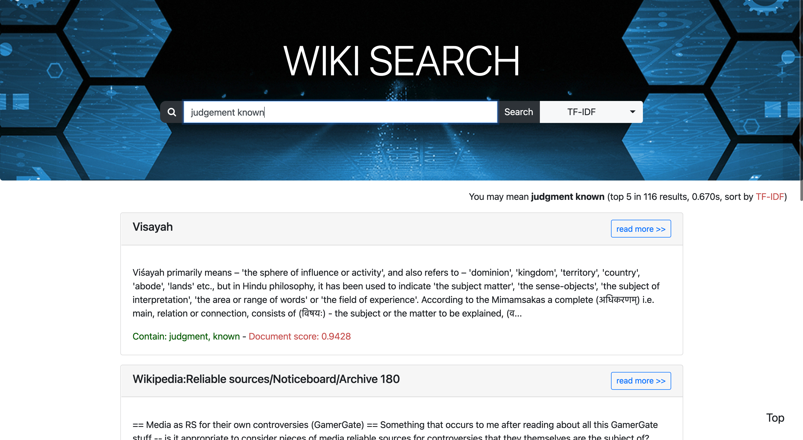
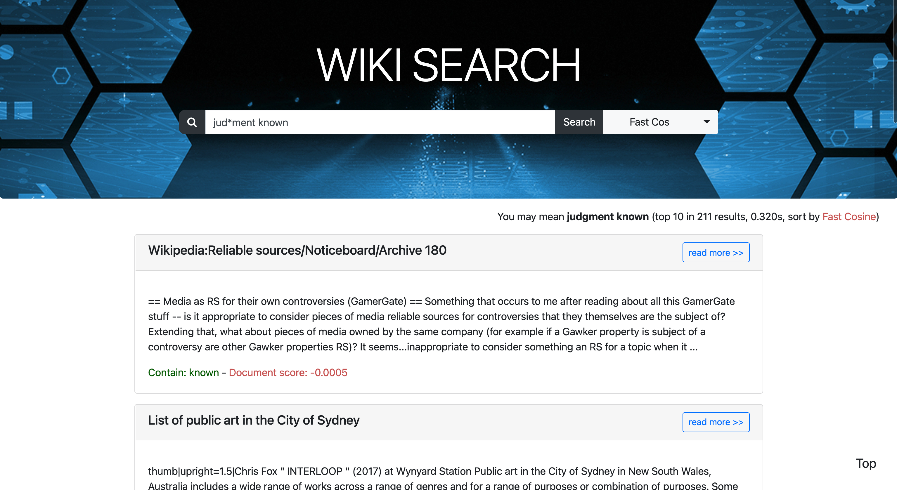

# Introduction

In this project, a simple search engine  is built up for Wikipedia with provided raw dumps. The system supports the basic search as well as **tolerant search** for misspelled or wild-card queries. The search process is **sped up** by eliminating indexes, building up a champion list, and computing concurrently. Besides, five kinds of **ranking algorithms** are implemented: TF-IDF, Cosine Similarity, Entropy IDF, Fast Cosine Similarity, and Weighted Zone. The **effectiveness and search time** of each ranking algorithms are compared in tables. Finally, a user-friendly website for the search system is built up based on the python web framework Django and other popular toolkits.


- data format:
    - Page{id, title, content}
    - Posting{term, postings}
- check data content
    ```bash
    $ python check_data.py
    ID: 0
    Title: Cliniodes insignialis
    Cliniodes insignialis is a moth in the family Crambidae. It was described by James E. Hayden in 2011. ...
    ...
    
    Term: 'hell'
    List of [Doc ID|TF]:
    283|1,313|1,384|1,837|1,851|1,1609|1,1792|1,1917|1,1919|1,2244|7,2411|1,2427|1,2880|1,3140|1,3565|2,4436|1,4996|1,5073|1,5082|1,6401|2,7354|1,8223|1,8303|1,8306|1,9172|1,9253|1,9708|1
    
    ```

- The directory of the website development part is shown as follows.

    .
    |--- manage.py
    |--- statics
    |  |--- bgimg.jpg
    |  |--- javascript
    |  |   --- index.js
    |   --- style
    |       --- mystyle.css
    |--- templates
    |  |--- details.html
    |   --- index.html
    --- web
       |--- asgi.py
       |--- settings.py
       |--- urls.py
       |--- views.py
        --- wsgi.py


# Result 

- The home page for the web search engine


- You can choose different rank algorithms, like TF-IDF, Cos Similarity, Entropy IDF, Fast Cos, and Weighted Zone.



- The website exhibits the title and the abstract of top $k$ documents in the form of cards.It shows the score of each document (*Document score*) and what terms each document contain  (*Contain*) in the results. The documents with higher ranking scores will be displayed on the top. What's more, the total number of retrieved documents, the time cost for ranking, and the name of the ranking algorithm are described on the upper right of all results. The users can scroll down to read all the documents and click on the *Top* button to quickly back to the top. 




- When users click the 'read more' button, they will open a new page tab and jump to *detail.html*. *detail.html* includes the title and more details about the retrieved documents. Terms contained in the query will be highlighted in a red and bold font style to help users fast find what they want in the document. 




- **Tolerant search**. The page shows the query by 'The query is ...'. If there is a spell mistake or wild-card in the query, it will show the query by 'You may mean ...'. 




- **Wild-card query.** The wild-card query is ' jud\*ment known', where '*' is the wild-card, and the  website shows the fuzzy query as 'You may mean **judgment known**'.


